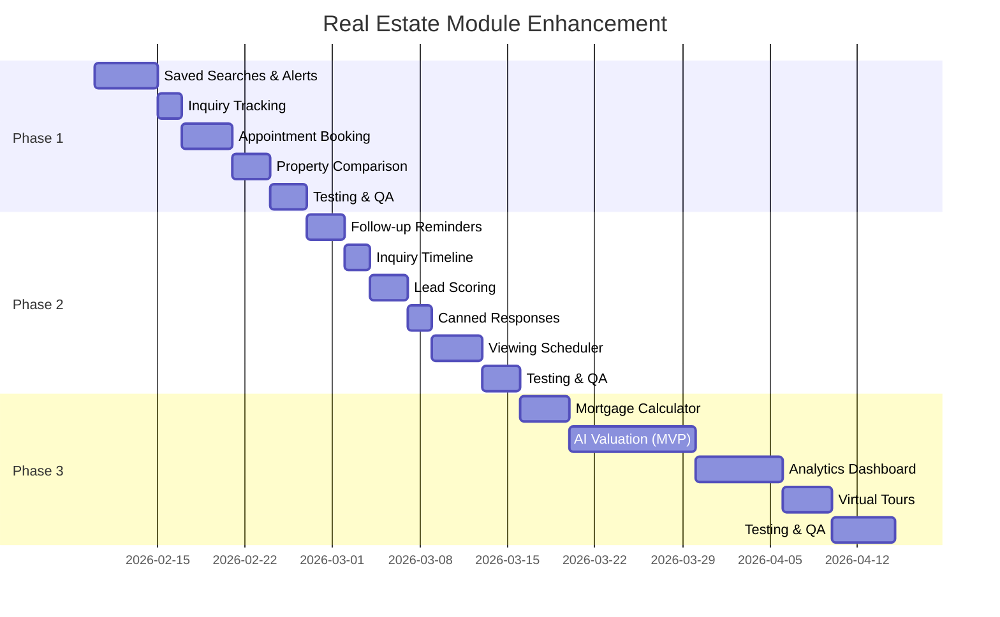

# Product Requirements Document (PRD)
## Real Estate Module Enhancement

> **Version**: 1.0  
> **Date**: February 9, 2026  
> **Author**: Development Team  
> **Status**: Draft

---

## 1. Overview

### 1.1 Purpose
This PRD defines the requirements for enhancing the Real Estate module to achieve feature parity with KSA market leaders (Bayut, Aqarmap) and provide competitive differentiation through AI-powered features.

### 1.2 Scope
Enhancement of the existing `Modules/RealEstate` module across three phases, covering user engagement, agent empowerment, and market differentiation features.

### 1.3 Success Metrics
| Metric | Current | Phase 1 Target | Phase 2 Target | Phase 3 Target |
|--------|---------|----------------|----------------|----------------|
| Feature Parity | 60% | 75% | 85% | 95% |
| User Return Rate | Baseline | +15% | +25% | +40% |
| Inquiry Conversion | Baseline | +10% | +20% | +30% |
| Agent Response Time | N/A | < 4 hours | < 2 hours | < 1 hour |

---

## 2. Current State Assessment

### 2.1 Existing Capabilities ✅
| Feature | Status | Quality |
|---------|--------|---------|
| Property CRUD | Complete | Production-ready |
| Compound Management | Complete | Production-ready |
| Hierarchical Areas | Complete | Production-ready |
| Advanced Search (Facets, Autocomplete) | Complete | Production-ready |
| Map View & Clusters | Complete | Production-ready |
| User Favorites | Complete | Production-ready |
| Property Inquiries | Complete | Production-ready |
| Multi-language (AR/EN) | Complete | Production-ready |
| Agent Dashboard | Partial | Basic functionality |

### 2.2 Identified Gaps ❌
| Gap Category | Specific Gap | Impact | Priority |
|--------------|--------------|--------|----------|
| User Engagement | No saved searches/alerts | Users re-search repeatedly | P1 |
| User Engagement | No inquiry tracking | No transparency | P1 |
| User Engagement | No appointment booking | Manual coordination | P1 |
| User Engagement | No property comparison | Decision difficulty | P1 |
| Agent Tools | No follow-up reminders | Missed leads | P1 |
| Agent Tools | No inquiry timeline | Lost context | P1 |
| Agent Tools | No viewing scheduler | Manual calendar | P2 |
| Agent Tools | No lead scoring | Inefficient prioritization | P2 |
| Agent Tools | No canned responses | Slow replies | P2 |
| Intelligence | No AI valuation | Behind competitors | P1 |
| Intelligence | No mortgage calculator | Missing expected feature | P1 |
| Intelligence | No analytics dashboard | No insights | P2 |
| Experience | No structured virtual tours | Limited immersion | P2 |

---

## 3. Phase 1: User Engagement Foundation

### 3.1 Overview
| Attribute | Value |
|-----------|-------|
| **Duration** | 2-3 weeks |
| **Effort** | 14 developer-days |
| **Priority** | P1 - Critical |
| **Dependencies** | None |

### 3.2 Features

---

#### F1.1: Saved Searches & Alerts

**Description**: Allow users to save search criteria and receive notifications when matching properties are listed.

**User Stories**:
- As a user, I want to save my search criteria so I don't have to re-enter them each time
- As a user, I want to receive alerts when new properties match my saved search
- As a user, I want to choose how often I receive alerts (instant/daily/weekly)

**Functional Requirements**:
| ID | Requirement | Priority |
|----|-------------|----------|
| F1.1.1 | User can save a search with a custom name | Must |
| F1.1.2 | System stores full search criteria (area, price range, bedrooms, type, etc.) | Must |
| F1.1.3 | User can enable/disable alerts per saved search | Must |
| F1.1.4 | User can set alert frequency (instant, daily, weekly) | Must |
| F1.1.5 | System sends alerts via email with matching properties | Must |
| F1.1.6 | System sends push notifications for instant alerts | Should |
| F1.1.7 | User can edit saved search criteria | Must |
| F1.1.8 | User can delete saved searches | Must |
| F1.1.9 | Maximum 10 saved searches per user | Must |

**API Endpoints**:
```
GET    /api/v1/tenant/{tenant}/realestate/saved-searches
POST   /api/v1/tenant/{tenant}/realestate/saved-searches
GET    /api/v1/tenant/{tenant}/realestate/saved-searches/{id}
PUT    /api/v1/tenant/{tenant}/realestate/saved-searches/{id}
DELETE /api/v1/tenant/{tenant}/realestate/saved-searches/{id}
POST   /api/v1/tenant/{tenant}/realestate/saved-searches/{id}/toggle-alerts
```

**Database Schema**:
```sql
CREATE TABLE re_saved_searches (
    id BIGINT UNSIGNED PRIMARY KEY AUTO_INCREMENT,
    user_id BIGINT UNSIGNED NOT NULL,
    name VARCHAR(255) NOT NULL,
    criteria JSON NOT NULL,
    alerts_enabled BOOLEAN DEFAULT TRUE,
    alert_frequency ENUM('instant', 'daily', 'weekly') DEFAULT 'daily',
    last_alerted_at TIMESTAMP NULL,
    created_at TIMESTAMP,
    updated_at TIMESTAMP,
    FOREIGN KEY (user_id) REFERENCES users(id) ON DELETE CASCADE
);
```

**Technical Implementation**:
| Component | Technology | Notes |
|-----------|------------|-------|
| Alert Matching | Laravel Scout + Meilisearch | Index new properties, match against saved criteria |
| Notification Delivery | Laravel Notifications | Email + Push channels |
| Scheduling | Laravel Task Scheduler | Daily digest at 9 AM, weekly on Sunday |
| Queue | Redis + Laravel Horizon | Async processing for instant alerts |

**Acceptance Criteria**:
- [ ] User can create, read, update, delete saved searches
- [ ] Alerts are sent within 5 minutes for instant frequency
- [ ] Daily digest sent at 9 AM local time
- [ ] Email contains first 5 matching properties with images
- [ ] Push notification links directly to search results

---

#### F1.2: Inquiry Tracking for Users

**Description**: Allow users to view their submitted inquiries and track status updates.

**User Stories**:
- As a user, I want to see all inquiries I've submitted
- As a user, I want to know the status of my inquiries (new, contacted, closed)
- As a user, I want to receive updates when my inquiry status changes

**Functional Requirements**:
| ID | Requirement | Priority |
|----|-------------|----------|
| F1.2.1 | User can view list of their inquiries | Must |
| F1.2.2 | Each inquiry shows property/compound details | Must |
| F1.2.3 | Each inquiry shows current status | Must |
| F1.2.4 | User receives notification on status change | Must |
| F1.2.5 | User can filter inquiries by status | Should |
| F1.2.6 | User can view inquiry history timeline | Should |

**API Endpoints**:
```
GET /api/v1/tenant/{tenant}/realestate/my-inquiries
GET /api/v1/tenant/{tenant}/realestate/my-inquiries/{id}
```

**Technical Implementation**:
- Extend `PropertyInquiry` model with user relationship
- Add `InquiryStatusChanged` event and listener
- Push notifications via WebSocket (Laravel Reverb)

---

#### F1.3: Appointment Booking

**Description**: Enable users to request property viewing appointments with agents.

**User Stories**:
- As a user, I want to request a viewing appointment for a property
- As a user, I want to suggest preferred date/time slots
- As a user, I want to receive confirmation when my appointment is confirmed
- As a user, I want calendar integration for reminders

**Functional Requirements**:
| ID | Requirement | Priority |
|----|-------------|----------|
| F1.3.1 | User can request appointment for property or compound | Must |
| F1.3.2 | User can select preferred date/time slots (up to 3) | Must |
| F1.3.3 | Agent receives notification of appointment request | Must |
| F1.3.4 | Agent can confirm, reschedule, or decline | Must |
| F1.3.5 | User receives notification of agent response | Must |
| F1.3.6 | Confirmed appointments include ICS calendar file | Should |
| F1.3.7 | Reminder sent 24 hours before appointment | Should |
| F1.3.8 | User can cancel appointment | Must |

**API Endpoints**:
```
POST   /api/v1/tenant/{tenant}/realestate/appointments
GET    /api/v1/tenant/{tenant}/realestate/appointments
GET    /api/v1/tenant/{tenant}/realestate/appointments/{id}
PATCH  /api/v1/tenant/{tenant}/realestate/appointments/{id}
DELETE /api/v1/tenant/{tenant}/realestate/appointments/{id}
GET    /api/v1/tenant/{tenant}/realestate/appointments/{id}/ics
```

**Database Schema**:
```sql
CREATE TABLE re_appointments (
    id BIGINT UNSIGNED PRIMARY KEY AUTO_INCREMENT,
    user_id BIGINT UNSIGNED NOT NULL,
    agent_id BIGINT UNSIGNED NULL,
    appointable_type VARCHAR(255) NOT NULL,
    appointable_id BIGINT UNSIGNED NOT NULL,
    preferred_slots JSON NOT NULL,
    scheduled_at DATETIME NULL,
    status ENUM('pending', 'confirmed', 'completed', 'cancelled', 'no_show') DEFAULT 'pending',
    notes TEXT NULL,
    cancellation_reason TEXT NULL,
    created_at TIMESTAMP,
    updated_at TIMESTAMP
);
```

---

#### F1.4: Property Comparison

**Description**: Allow users to compare multiple properties side-by-side.

**User Stories**:
- As a user, I want to add properties to a comparison list
- As a user, I want to see properties compared side-by-side
- As a user, I want to see visual charts comparing prices and areas

**Functional Requirements**:
| ID | Requirement | Priority |
|----|-------------|----------|
| F1.4.1 | User can add up to 4 properties to comparison | Must |
| F1.4.2 | Comparison persists in session/local storage | Must |
| F1.4.3 | Side-by-side table with all property attributes | Must |
| F1.4.4 | Visual chart comparing prices | Should |
| F1.4.5 | Highlight differences between properties | Should |
| F1.4.6 | Share comparison via link | Could |

**API Endpoints**:
```
POST /api/v1/tenant/{tenant}/realestate/compare
GET  /api/v1/tenant/{tenant}/realestate/compare?ids=1,2,3,4
```

---

## 4. Phase 2: Agent Empowerment

### 4.1 Overview
| Attribute | Value |
|-----------|-------|
| **Duration** | 2-3 weeks |
| **Effort** | 14 developer-days |
| **Priority** | P1 - Critical |
| **Dependencies** | Phase 1 (optional, can run parallel) |

### 4.2 Features

---

#### F2.1: Follow-up Reminders & SLA Timers

**Description**: Help agents track response deadlines and set follow-up reminders.

**User Stories**:
- As an agent, I want to see which inquiries need urgent attention
- As an agent, I want to set reminders for follow-up calls
- As an agent, I want to be notified when an SLA is about to breach

**Functional Requirements**:
| ID | Requirement | Priority |
|----|-------------|----------|
| F2.1.1 | System tracks time since inquiry creation | Must |
| F2.1.2 | SLA timer shows countdown (4h/24h/48h thresholds) | Must |
| F2.1.3 | Agent can create reminders with date/time | Must |
| F2.1.4 | Agent receives push notification for reminders | Must |
| F2.1.5 | Dashboard shows SLA breach warnings | Must |
| F2.1.6 | Manager can view team SLA performance | Should |

**API Endpoints**:
```
POST  /api/v1/tenant/{tenant}/agent/realestate/inquiries/{id}/reminders
GET   /api/v1/tenant/{tenant}/agent/realestate/reminders
PATCH /api/v1/tenant/{tenant}/agent/realestate/reminders/{id}
DELETE /api/v1/tenant/{tenant}/agent/realestate/reminders/{id}
GET   /api/v1/tenant/{tenant}/agent/realestate/sla/summary
```

**Database Schema**:
```sql
CREATE TABLE re_reminders (
    id BIGINT UNSIGNED PRIMARY KEY AUTO_INCREMENT,
    agent_id BIGINT UNSIGNED NOT NULL,
    inquiry_id BIGINT UNSIGNED NOT NULL,
    remind_at DATETIME NOT NULL,
    message VARCHAR(500),
    is_completed BOOLEAN DEFAULT FALSE,
    created_at TIMESTAMP,
    updated_at TIMESTAMP
);
```

---

#### F2.2: Inquiry Timeline & Notes

**Description**: Maintain complete history of all interactions with an inquiry.

**Functional Requirements**:
| ID | Requirement | Priority |
|----|-------------|----------|
| F2.2.1 | Auto-log status changes with timestamp | Must |
| F2.2.2 | Auto-log agent assignments | Must |
| F2.2.3 | Agent can add manual notes | Must |
| F2.2.4 | Notes can be marked internal (not visible to user) | Must |
| F2.2.5 | File attachments supported on notes | Should |
| F2.2.6 | Timeline shows chronological view of all activity | Must |

**API Endpoints**:
```
GET  /api/v1/tenant/{tenant}/agent/realestate/inquiries/{id}/timeline
POST /api/v1/tenant/{tenant}/agent/realestate/inquiries/{id}/notes
```

---

#### F2.3: Lead Scoring

**Description**: Automatically prioritize leads based on engagement and fit signals.

**Functional Requirements**:
| ID | Requirement | Priority |
|----|-------------|----------|
| F2.3.1 | System calculates lead score (0-100) | Must |
| F2.3.2 | Score factors: budget match, verification, engagement | Must |
| F2.3.3 | Inquiry list sortable by lead score | Must |
| F2.3.4 | Visual indicator (hot/warm/cold) on inquiry cards | Must |
| F2.3.5 | Agent can manually adjust score | Should |

**Scoring Algorithm**:
| Factor | Points | Condition |
|--------|--------|-----------|
| Budget Match | +30 | User budget ≥ property price |
| Phone Verified | +15 | User has verified phone |
| Email Verified | +10 | User has verified email |
| Fresh Lead | +15 | Created within 24 hours |
| Detailed Message | +10 | Message > 50 characters |
| Repeat User | +10 | User has previous inquiries |
| Quick Response | +10 | User responded to agent within 1 hour |

---

#### F2.4: Canned Responses & Templates

**Description**: Pre-written response templates for common scenarios.

**Functional Requirements**:
| ID | Requirement | Priority |
|----|-------------|----------|
| F2.4.1 | Admin can create template categories | Must |
| F2.4.2 | Admin can create templates with variables | Must |
| F2.4.3 | Variables auto-replaced: {{property.title}}, {{user.name}} | Must |
| F2.4.4 | Agent can select and send template | Must |
| F2.4.5 | Templates support Arabic and English | Must |
| F2.4.6 | Agent can edit template before sending | Should |

**API Endpoints**:
```
GET  /api/v1/tenant/{tenant}/agent/realestate/templates
POST /api/v1/tenant/{tenant}/agent/realestate/templates
PUT  /api/v1/tenant/{tenant}/agent/realestate/templates/{id}
DELETE /api/v1/tenant/{tenant}/agent/realestate/templates/{id}
POST /api/v1/tenant/{tenant}/agent/realestate/inquiries/{id}/send-template
```

---

#### F2.5: Viewing Scheduler

**Description**: Manage property viewing appointments efficiently.

**Functional Requirements**:
| ID | Requirement | Priority |
|----|-------------|----------|
| F2.5.1 | Agent sees calendar view of all viewings | Must |
| F2.5.2 | Agent can confirm/reschedule/cancel requests | Must |
| F2.5.3 | Agent can block unavailable time slots | Should |
| F2.5.4 | Agent receives daily viewing summary | Should |
| F2.5.5 | Viewing report: completed, no-show, cancelled | Should |

**API Endpoints**:
```
GET   /api/v1/tenant/{tenant}/agent/realestate/viewings
GET   /api/v1/tenant/{tenant}/agent/realestate/viewings/calendar
POST  /api/v1/tenant/{tenant}/agent/realestate/viewings
PATCH /api/v1/tenant/{tenant}/agent/realestate/viewings/{id}
DELETE /api/v1/tenant/{tenant}/agent/realestate/viewings/{id}
POST  /api/v1/tenant/{tenant}/agent/realestate/viewings/{id}/complete
```

---

## 5. Phase 3: Market Differentiation

### 5.1 Overview
| Attribute | Value |
|-----------|-------|
| **Duration** | 4-6 weeks |
| **Effort** | 25 developer-days |
| **Priority** | P2 - High |
| **Dependencies** | Phase 1, Phase 2 (recommended) |

### 5.2 Features

---

#### F3.1: Mortgage Calculator

**Description**: Interactive tool to estimate monthly mortgage payments.

**User Stories**:
- As a user, I want to calculate monthly payments based on property price
- As a user, I want to see different down payment scenarios
- As a user, I want to understand total interest paid

**Functional Requirements**:
| ID | Requirement | Priority |
|----|-------------|----------|
| F3.1.1 | Calculate monthly payment from principal, rate, term | Must |
| F3.1.2 | Show amortization breakdown (principal vs interest) | Must |
| F3.1.3 | Support multiple down payment percentages (10/20/30%) | Must |
| F3.1.4 | Show total interest over loan term | Must |
| F3.1.5 | Pre-populate with property price | Should |
| F3.1.6 | Bank rate comparison (if API available) | Could |
| F3.1.7 | REDF eligibility checker | Could |

**API Endpoints**:
```
POST /api/v1/tenant/{tenant}/realestate/finance/calculate
GET  /api/v1/tenant/{tenant}/realestate/finance/rates
GET  /api/v1/tenant/{tenant}/realestate/finance/eligibility
```

**Response Example**:
```json
{
  "scenarios": [
    {
      "down_payment_percent": 20,
      "down_payment_amount": 200000,
      "loan_amount": 800000,
      "monthly_payment": 4265.45,
      "total_payment": 1535562,
      "total_interest": 735562
    }
  ],
  "amortization_schedule": [...]
}
```

---

#### F3.2: AI Property Valuation

**Description**: Machine learning-powered property price estimation.

**User Stories**:
- As a user, I want to know the estimated market value of a property
- As a user, I want to see comparable properties that informed the valuation
- As an agent, I want to provide data-backed price recommendations

**Functional Requirements**:
| ID | Requirement | Priority |
|----|-------------|----------|
| F3.2.1 | Estimate property value based on attributes | Must |
| F3.2.2 | Show confidence score (high/medium/low) | Must |
| F3.2.3 | Show comparable properties used | Must |
| F3.2.4 | Show value range (min-max) | Must |
| F3.2.5 | Explain key valuation factors | Should |
| F3.2.6 | Track price history over time | Should |
| F3.2.7 | Rental yield estimation | Could |

**API Endpoints**:
```
POST /api/v1/tenant/{tenant}/realestate/valuation/estimate
GET  /api/v1/tenant/{tenant}/realestate/valuation/comparables/{property}
GET  /api/v1/tenant/{tenant}/realestate/properties/{property}/price-history
```

**Technical Architecture**:
```
┌─────────────────┐     ┌──────────────────┐     ┌─────────────────┐
│  Laravel API    │────▶│  FastAPI Python  │────▶│  ML Model       │
│  (Gateway)      │     │  (Microservice)  │     │  (XGBoost)      │
└─────────────────┘     └──────────────────┘     └─────────────────┘
                               │
                               ▼
                        ┌──────────────────┐
                        │  Redis Cache     │
                        │  (Valuations)    │
                        └──────────────────┘
```

**ML Features**:
| Feature | Type | Weight |
|---------|------|--------|
| area_sqm | Numeric | High |
| bedrooms | Numeric | Medium |
| bathrooms | Numeric | Medium |
| floor | Numeric | Low |
| property_age | Numeric | Medium |
| area_avg_price_sqm | Numeric | High |
| amenities_count | Numeric | Low |
| developer_rating | Numeric | Medium |

---

#### F3.3: Analytics Dashboard

**Description**: Comprehensive analytics for admins and agents.

**Functional Requirements**:
| ID | Requirement | Priority |
|----|-------------|----------|
| F3.3.1 | Admin overview: total properties, inquiries, conversions | Must |
| F3.3.2 | Area price trends over time | Must |
| F3.3.3 | Most viewed properties/compounds | Must |
| F3.3.4 | Agent performance metrics | Must |
| F3.3.5 | Inquiry funnel visualization | Should |
| F3.3.6 | Heat map of demand by area | Should |
| F3.3.7 | Export reports (Excel, PDF) | Should |

**API Endpoints**:
```
GET /api/v1/tenant/{tenant}/admin/realestate/analytics/overview
GET /api/v1/tenant/{tenant}/admin/realestate/analytics/trends
GET /api/v1/tenant/{tenant}/admin/realestate/analytics/performance
GET /api/v1/tenant/{tenant}/admin/realestate/analytics/heatmap
GET /api/v1/tenant/{tenant}/admin/realestate/analytics/export
GET /api/v1/tenant/{tenant}/agent/realestate/analytics/my-performance
```

---

#### F3.4: Enhanced Virtual Tours

**Description**: Structured support for immersive property viewing experiences.

**Functional Requirements**:
| ID | Requirement | Priority |
|----|-------------|----------|
| F3.4.1 | Multiple virtual tours per property | Must |
| F3.4.2 | Support Matterport, Kuula, etc. | Must |
| F3.4.3 | 360° image support | Must |
| F3.4.4 | Video tour embedding | Should |
| F3.4.5 | Tour thumbnail generation | Should |
| F3.4.6 | Mobile-optimized viewer | Must |

**Database Schema**:
```sql
CREATE TABLE re_virtual_tours (
    id BIGINT UNSIGNED PRIMARY KEY AUTO_INCREMENT,
    toureable_type VARCHAR(255) NOT NULL,
    toureable_id BIGINT UNSIGNED NOT NULL,
    type ENUM('matterport', '360_photo', 'video', 'external') NOT NULL,
    provider VARCHAR(100),
    external_id VARCHAR(255),
    embed_url TEXT NOT NULL,
    thumbnail VARCHAR(500),
    `order` INT DEFAULT 0,
    created_at TIMESTAMP,
    updated_at TIMESTAMP,
    INDEX idx_toureable (toureable_type, toureable_id)
);
```

---

## 6. Technical Dependencies

### 6.1 Required Packages

| Package | Purpose | Phase |
|---------|---------|-------|
| `laravel/scout` + `meilisearch/meilisearch-php` | Search indexing for alerts | 1 |
| `spatie/laravel-activitylog` | Timeline and audit trail | 2 |
| `spatie/laravel-medialibrary` | File attachments | 2 |
| `spatie/icalendar-generator` | Calendar file generation | 1 |
| `laravel/reverb` | Real-time notifications | 1 |
| `brick/math` | Financial calculations | 3 |
| `maatwebsite/excel` | Report exports | 3 |
| `barryvdh/laravel-dompdf` | PDF generation | 3 |

### 6.2 Infrastructure Requirements

| Component | Requirement | Phase |
|-----------|-------------|-------|
| Redis | Queue and caching | 1 |
| Meilisearch | Search engine | 1 |
| Laravel Horizon | Queue dashboard | 1 |
| Python 3.9+ | ML microservice | 3 |
| FastAPI | ML API | 3 |

---

## 7. Release Plan

### 7.1 Timeline



### 7.2 Milestones

| Milestone | Target Date | Deliverables |
|-----------|-------------|--------------|
| Phase 1 Complete | Week 3 | User engagement features live |
| Phase 2 Complete | Week 6 | Agent tools live |
| Phase 3 MVP | Week 10 | Calculator + Valuation |
| Phase 3 Complete | Week 12 | Full analytics + virtual tours |

---

## 8. Risk Assessment

| Risk | Impact | Probability | Mitigation |
|------|--------|-------------|------------|
| ML model accuracy insufficient | High | Medium | Start with rule-based fallback, iterate |
| Third-party API rate limits | Medium | Low | Implement caching, queue requests |
| Real-time notifications latency | Medium | Low | Use Laravel Reverb, fallback to polling |
| Complex query performance | High | Medium | Optimize with indexes, materialized views |
| Multi-tenant data isolation | Critical | Low | Thorough testing, code review |

---

## 9. Appendix

### 9.1 Related Documents
- [Real Estate Module Upgrade Analysis](./REALESTATE_MODULE_UPGRADE.md)
- [User & Agent Capabilities](./REAL_ESTATE_USER_AGENT_CAPABILITIES.md)

### 9.2 API Authentication
All endpoints require tenant context via:
- Header: `X-Tenant-Token: {token}`
- URL: `/api/v1/tenant/{tenant}/...`

User/Agent endpoints additionally require:
- Header: `Authorization: Bearer {access_token}`

### 9.3 Revision History
| Version | Date | Author | Changes |
|---------|------|--------|---------|
| 1.0 | 2026-02-09 | Dev Team | Initial PRD |
