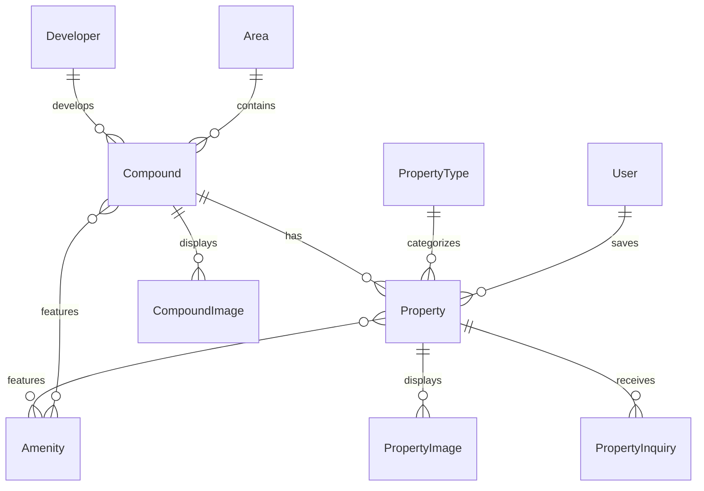

# Real Estate Module Upgrade Analysis

> **Date**: February 9, 2026  
> **Module**: `Modules/RealEstate`  
> **Benchmark**: Bayut KSA, Aqarmap, and KSA Market Leaders

---

## Executive Summary

This report provides a comprehensive analysis of the current Real Estate module implementation in the aqar-api project, comparing it against high-end KSA real estate platforms (Bayut, Aqarmap, PropertyFinder). The analysis evaluates **functional completeness**, **competitive positioning**, and **customer experience readiness**.

### Overall Assessment

| Category | Current Status | Industry Standard | Gap Level |
|----------|---------------|-------------------|-----------|
| **Core Property Management** | ✅ Strong | ✅ Complete | Low |
| **Search & Discovery** | ✅ Strong | ✅ Complete | Low |
| **User Engagement** | ⚠️ Basic | ✅ Advanced | Medium |
| **Agent/CRM Tools** | ⚠️ Basic | ✅ Advanced | Medium-High |
| **AI/Analytics** | ❌ Missing | ✅ Essential | Critical |
| **Immersive Experience** | ⚠️ Partial | ✅ Advanced | Medium |
| **Financial Tools** | ❌ Missing | ✅ Essential | Critical |

---

## 1. Current Module Architecture

### 1.1 Entity Structure (9 Entities)



| Entity | Purpose | Key Features |
|--------|---------|--------------|
| **Property** | Individual units/listings | 48 methods, full scopes, geospatial support |
| **Compound** | Projects/developments | Virtual tour URL, construction status tracking |
| **Area** | Hierarchical locations | Tree structure, breadcrumbs, cities |
| **Developer** | Real estate developers | Established year, compound relations |
| **PropertyType** | Categories (Villa, Apt, etc.) | Translatable, slug-based |
| **Amenity** | Features/facilities | Icon support, categories |
| **PropertyInquiry** | Lead management | Status tracking, agent assignment |
| **PropertyImage/CompoundImage** | Media galleries | Ordering, primary image selection |

### 1.2 Database Schema (18 Migrations)

- **Core Tables**: `re_properties`, `re_compounds`, `re_areas`, `re_developers`
- **Supporting Tables**: `re_property_types`, `re_amenities`, `re_property_images`, `re_compound_images`
- **Junction Tables**: `re_property_amenities`, `re_compound_amenities`, `re_saved_properties`
- **Geospatial Columns**: Latitude/longitude with spatial indexing

### 1.3 Service & Controller Architecture

| Layer | Count | Purpose |
|-------|-------|---------|
| Services | 5 | PropertyService, CompoundService, AreaService, SearchService, InquiryService |
| Frontend Controllers | 10 | Public browsing, search, inquiries |
| Admin Controllers | 8 | Full CRUD, media management |
| Agent Controllers | 1 | Dashboard, assigned properties/inquiries |

---

## 2. Feature Comparison with KSA Market Leaders

### 2.1 Feature Matrix

| Feature | Bayut | Aqarmap | Our Module | Gap |
|---------|-------|---------|------------|-----|
| Comprehensive Search Filters | ✅ | ✅ | ✅ | — |
| Detailed Listings with Photos | ✅ | ✅ | ✅ | — |
| Favorites & Alerts | ✅ | ✅ | ⚠️ Favorites only | Alerts missing |
| Map View (Interactive) | ✅ | ✅ | ✅ | — |
| Arabic Language Support | ✅ | ✅ | ✅ | — |
| **TruEstimate™ (AI Valuation)** | ✅ | ✅ | ❌ | **Critical** |
| **Mortgage Calculator** | ✅ | ✅ | ❌ | **Critical** |
| **Analytics Dashboard** | ✅ | ✅ | ❌ | **Critical** |
| Agent CRM Tools | ✅ | ✅ | ⚠️ Basic | **High** |
| Virtual Tours | ✅ | ✅ | ⚠️ URL only | **Medium** |

---

## 3. Technical Recommendations for Proposed Additions

### 3.1 Phase 1: User Engagement Features

#### Saved Searches & Alerts

**Technical Tools & Techniques:**
| Tool/Technique | Purpose | Implementation |
|----------------|---------|----------------|
| **Laravel Scout + Meilisearch** | Index saved search criteria for fast matching | Store search JSON, match against new listings |
| **Laravel Notifications** | Multi-channel alerts (Email, SMS, Push) | Use `Notifiable` trait with custom channels |
| **Redis Pub/Sub** | Real-time new listing broadcasting | Publish on property create, subscribers match criteria |
| **Laravel Queues** | Async alert processing | Queue jobs for matching and notifications |
| **Database JSON Columns** | Flexible criteria storage | MySQL 8 JSON functions for query matching |

```php
// Recommended Schema
Schema::create('re_saved_searches', function (Blueprint $table) {
    $table->id();
    $table->foreignId('user_id')->constrained();
    $table->string('name');
    $table->json('criteria'); // {area_id, price_min, price_max, bedrooms, etc.}
    $table->boolean('alerts_enabled')->default(true);
    $table->enum('alert_frequency', ['instant', 'daily', 'weekly']);
    $table->timestamp('last_alerted_at')->nullable();
    $table->timestamps();
});
```

---

#### Inquiry Tracking for Users

**Technical Tools & Techniques:**
| Tool/Technique | Purpose | Implementation |
|----------------|---------|----------------|
| **Polymorphic Relations** | Single inquiry model for property/compound/general | `inquirable_type`, `inquirable_id` |
| **Spatie Activitylog** | Track inquiry status changes | Auto-log status transitions |
| **Laravel Events** | Status change notifications | `InquiryStatusChanged` event |
| **WebSocket (Laravel Reverb)** | Real-time status updates | Push to user's browser |

---

#### Property Comparison Tool

**Technical Tools & Techniques:**
| Tool/Technique | Purpose | Implementation |
|----------------|---------|----------------|
| **Session Storage** | Temporary comparison lists | `session(['comparison' => [...]])` |
| **Vue/React State** | Frontend comparison UI | Global store (Pinia/Redux) |
| **DTOs (Data Transfer Objects)** | Normalized comparison data | `PropertyComparisonDTO` with unified attrs |
| **Chart.js / ApexCharts** | Visual comparison graphs | Price/sqm charts |

---

#### Appointment Booking

**Technical Tools & Techniques:**
| Tool/Technique | Purpose | Implementation |
|----------------|---------|----------------|
| **Spatie Calendar** | Availability management | Agent calendar with time slots |
| **Laravel Notifications** | Booking confirmations | Email + SMS reminders |
| **ics File Generation** | Calendar integration | `spatie/icalendar-generator` |
| **Google Calendar API** | Optional sync | OAuth integration for agents |

```php
// Recommended Schema
Schema::create('re_appointments', function (Blueprint $table) {
    $table->id();
    $table->foreignId('user_id')->constrained();
    $table->foreignId('agent_id')->constrained('users');
    $table->morphs('appointable'); // property or compound
    $table->dateTime('scheduled_at');
    $table->enum('status', ['pending', 'confirmed', 'completed', 'cancelled']);
    $table->text('notes')->nullable();
    $table->timestamps();
});
```

---

### 3.2 Phase 2: Agent Empowerment Features

#### Follow-up Reminders & SLA Timers

**Technical Tools & Techniques:**
| Tool/Technique | Purpose | Implementation |
|----------------|---------|----------------|
| **Laravel Task Scheduling** | Daily SLA checks | `schedule->daily()->at('09:00')` |
| **Spatie Reminder** or Custom | Reminder management | Store `remind_at`, queue notifications |
| **Redis TTL Keys** | SLA breach detection | Key expires = SLA breached |
| **Dashboard Widgets** | Visual SLA indicators | Color-coded inquiry cards |

---

#### Inquiry Timeline & Notes

**Technical Tools & Techniques:**
| Tool/Technique | Purpose | Implementation |
|----------------|---------|----------------|
| **Spatie Activitylog** | Full audit trail | Auto-log all changes with causer |
| **Polymorphic Notes** | Attached notes to any entity | `notable_type`, `notable_id` |
| **Mentionable** | @mention agents in notes | Parse `@username`, notify mentioned |
| **File Attachments** | Documents in timeline | `spatie/laravel-medialibrary` |

```php
// Recommended Schema
Schema::create('re_inquiry_notes', function (Blueprint $table) {
    $table->id();
    $table->foreignId('inquiry_id')->constrained('re_property_inquiries');
    $table->foreignId('user_id')->constrained();
    $table->text('content');
    $table->boolean('is_internal')->default(true);
    $table->timestamps();
});
```

---

#### Lead Scoring

**Technical Tools & Techniques:**
| Tool/Technique | Purpose | Implementation |
|----------------|---------|----------------|
| **Weighted Scoring Algorithm** | Calculate lead priority | Budget proximity, engagement, response time |
| **Database Triggers/Observers** | Auto-update scores | Recalculate on inquiry activity |
| **ML (Optional)** | Predictive scoring | Python microservice with scikit-learn |
| **Priority Queue** | Agent inbox ordering | Order by `lead_score DESC` |

```php
// Scoring factors example
$leadScore = 0;
$leadScore += $inquiry->budget >= $property->price ? 30 : 0;      // Budget match
$leadScore += $inquiry->user->inquiries_count <= 3 ? 20 : 0;      // Not spam
$leadScore += $inquiry->user->phone_verified ? 15 : 0;            // Verified
$leadScore += $inquiry->created_at->isToday() ? 10 : 0;           // Fresh lead
$leadScore += $inquiry->message_length > 50 ? 10 : 0;             // Detailed inquiry
```

---

#### Canned Responses & Templates

**Technical Tools & Techniques:**
| Tool/Technique | Purpose | Implementation |
|----------------|---------|----------------|
| **Blade/Twig Templates** | Variable substitution | `{{property.title}}`, `{{user.name}}` |
| **WYSIWYG Editor** | Rich template creation | TinyMCE, Quill |
| **Template Categories** | Organization | `initial_response`, `follow_up`, `viewing_invite` |
| **Multi-language** | AR/EN templates | Separate templates per locale |

---

### 3.3 Phase 3: Market Differentiation Features

#### Mortgage/Financing Calculator

**Technical Tools & Techniques:**
| Tool/Technique | Purpose | Implementation |
|----------------|---------|----------------|
| **Financial Math Library** | Amortization calculations | `brick/math` for precision |
| **Bank Rate API** | Live rates (optional) | Integration with SAMA-approved sources |
| **Eligibility Rules Engine** | REDF/Sakani criteria | Configurable rules per program |
| **Interactive Charts** | Visual payment breakdown | Chart.js donut/bar charts |

```php
// Mortgage calculation service
class MortgageCalculatorService
{
    public function calculateMonthlyPayment(
        float $principal,
        float $annualRate,
        int $termMonths
    ): array {
        $monthlyRate = $annualRate / 12 / 100;
        $payment = $principal * ($monthlyRate * pow(1 + $monthlyRate, $termMonths)) 
                   / (pow(1 + $monthlyRate, $termMonths) - 1);
        
        return [
            'monthly_payment' => round($payment, 2),
            'total_payment' => round($payment * $termMonths, 2),
            'total_interest' => round(($payment * $termMonths) - $principal, 2),
        ];
    }
}
```

---

#### AI Property Valuation (TruEstimate™ Alternative)

**Technical Tools & Techniques:**
| Tool/Technique | Purpose | Implementation |
|----------------|---------|----------------|
| **Python ML Microservice** | Valuation model | FastAPI + scikit-learn/XGBoost |
| **Comparable Sales Algorithm** | Find similar properties | KNN on area, bedrooms, size |
| **Historical Price Data** | Training data | Store `re_price_history` table |
| **OpenAI/Claude API** | Natural language explanations | Explain valuation factors |
| **Confidence Intervals** | Accuracy indication | Statistical confidence scoring |

```python
# Simplified valuation model
from sklearn.ensemble import GradientBoostingRegressor

features = ['area_sqm', 'bedrooms', 'bathrooms', 'floor', 'age_years', 'location_score']
model = GradientBoostingRegressor()
model.fit(X_train[features], y_train['price'])

def estimate_value(property_data):
    prediction = model.predict([property_data])[0]
    confidence = calculate_confidence(property_data, training_data)
    return {'estimated_value': prediction, 'confidence': confidence}
```

---

#### Analytics & Market Intelligence

**Technical Tools & Techniques:**
| Tool/Technique | Purpose | Implementation |
|----------------|---------|----------------|
| **Laravel Analytics Package** | View tracking | `spatie/laravel-analytics` or custom |
| **Time-Series DB (Optional)** | High-volume metrics | TimescaleDB or InfluxDB |
| **Materialized Views** | Pre-computed aggregates | Daily refresh of statistics |
| **Chart Libraries** | Dashboard visualization | ApexCharts, ECharts |
| **Export Functionality** | Reports | Excel via `maatwebsite/excel`, PDF via `barryvdh/laravel-dompdf` |

```php
// Analytics queries
class AnalyticsService
{
    public function getAreaTrends(int $areaId, int $months = 12): array
    {
        return Property::where('area_id', $areaId)
            ->selectRaw('DATE_FORMAT(created_at, "%Y-%m") as month')
            ->selectRaw('AVG(price) as avg_price')
            ->selectRaw('AVG(price / area_sqm) as avg_price_per_sqm')
            ->selectRaw('COUNT(*) as listings_count')
            ->groupByRaw('DATE_FORMAT(created_at, "%Y-%m")')
            ->orderBy('month')
            ->limit($months)
            ->get();
    }
}
```

---

#### Enhanced Virtual Tours & 3D

**Technical Tools & Techniques:**
| Tool/Technique | Purpose | Implementation |
|----------------|---------|----------------|
| **Matterport API** | 3D scan integration | Embed SDK, store scan IDs |
| **360° Image Viewer** | Panoramic photos | Pannellum.js, Photo Sphere Viewer |
| **Video Streaming** | Property videos | HLS via AWS MediaConvert |
| **AR/VR (Future)** | Mobile AR experience | ARCore/ARKit integration |

```php
// New schema for structured virtual tours
Schema::create('re_virtual_tours', function (Blueprint $table) {
    $table->id();
    $table->morphs('toureable'); // property or compound
    $table->enum('type', ['matterport', '360_photo', 'video', 'external']);
    $table->string('provider')->nullable(); // matterport, kuula, etc.
    $table->string('external_id')->nullable();
    $table->string('embed_url');
    $table->string('thumbnail')->nullable();
    $table->integer('order')->default(0);
    $table->timestamps();
});
```

---

## 4. Summary

### What's Good ✅
- Well-structured entity relationships with 48+ methods on Property
- Comprehensive search with facets, autocomplete, map clusters
- Multi-tenant and multi-language support (Spatie Translatable)
- Geospatial support with proper indexing

### Critical Gaps ❌
1. **AI/Analytics** - Property valuation, market trends, lead scoring
2. **Financial Tools** - Mortgage calculator, financing guidance
3. **User Engagement** - Saved searches with alerts, inquiry tracking
4. **Agent Tools** - CRM features, reminders, templates

### Competitive Position
| Phase | Features Added | Parity with Leaders |
|-------|---------------|---------------------|
| Current | Baseline | ~60% |
| Phase 1 | User engagement | ~75% |
| Phase 2 | Agent tools | ~85% |
| Phase 3 | AI/Analytics | ~95% |

---

## Related Documents

- [PRD: Real Estate Module Phases](./REALESTATE_MODULE_PRD.md)
- [User & Agent Capabilities](./REAL_ESTATE_USER_AGENT_CAPABILITIES.md)
